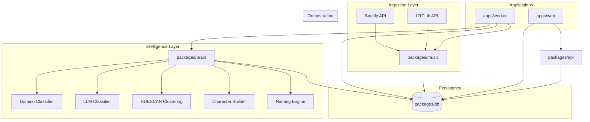
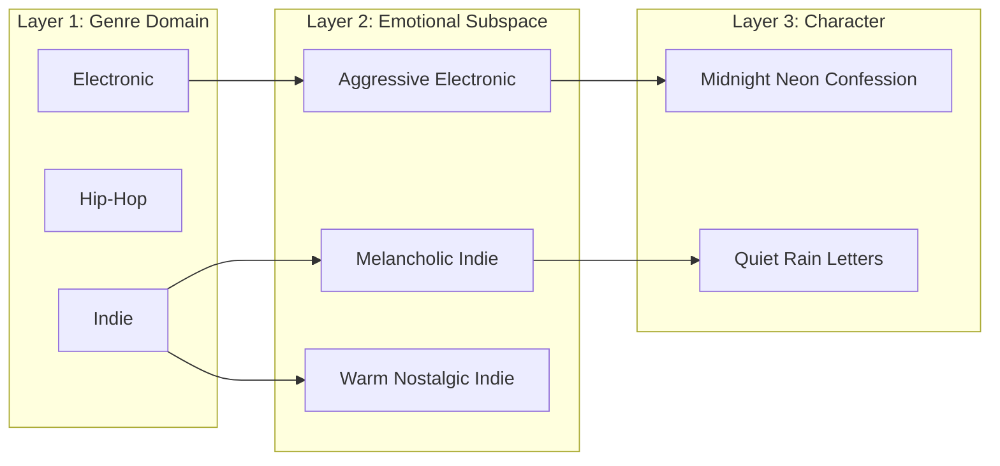
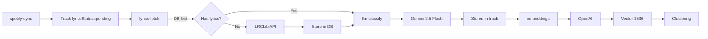

# Harmonia v1 — Full Implementation Plan

## Architecture Overview




---

## Data Flow: Genre Domain to Character



---

## Data Flow: Lyrics, LLM, Embeddings Pipeline




---

## 1. Updated Folder Structure

```
harmonia/
├── apps/
│   ├── web/                    # Next.js (existing)
│   └── worker/                 # NEW: Background jobs
│       ├── src/
│       │   ├── index.ts        # Entry point
│       │   ├── tasks/          # Task definitions
│       │   │   ├── spotify-sync.ts
│       │   │   ├── lyrics-fetch.ts
│       │   │   ├── llm-classify.ts
│       │   │   ├── embeddings.ts
│       │   │   ├── clustering.ts
│       │   │   └── character-gen.ts
│       │   └── scheduler.ts    # Cron / job runner
│       ├── package.json
│       └── tsconfig.json
├── packages/
│   ├── api/                    # oRPC routes (existing)
│   ├── auth/                   # Better-Auth + Spotify (existing, extend)
│   ├── brain/                  # NEW: Clustering + character engine
│   │   ├── src/
│   │   │   ├── index.ts
│   │   │   ├── domain-classifier.ts
│   │   │   ├── llm-classifier.ts  # Gemini 2.5 Flash mood/themes
│   │   │   ├── clustering/
│   │   │   │   ├── hdbscan.ts
│   │   │   │   └── coherence.ts
│   │   │   ├── character/
│   │   │   │   ├── builder.ts
│   │   │   │   └── naming.ts
│   │   │   └── types.ts
│   │   └── package.json
│   ├── config/                 # Shared TS config (existing)
│   ├── db/                     # Schema + Drizzle (existing, extend)
│   ├── env/                    # Env validation (existing, extend)
│   ├── music/                  # NEW: Spotify + LRCLib client
│   │   ├── src/
│   │   │   ├── index.ts
│   │   │   ├── client.ts       # Spotify Web API wrapper
│   │   │   ├── audio-features.ts
│   │   │   ├── liked-tracks.ts
│   │   │   ├── lrclib.ts       # LRCLib lyrics API client
│   │   │   └── types.ts
│   │   └── package.json
│   └── env/                    # (existing)
├── package.json
├── pnpm-workspace.yaml
└── turbo.json
```

---

## 2. Full Database Schema (Drizzle)

All new schema files live in [packages/db/src/schema/](packages/db/src/schema/).

### 2.1 genre_domain

```ts
// packages/db/src/schema/genre-domain.ts
import { pgTable, text, serial } from "drizzle-orm/pg-core";

export const genreDomain = pgTable("genre_domain", {
  id: serial("id").primaryKey(),
  name: text("name").notNull().unique(),
  description: text("description"),
});
```

### 2.2 track

```ts
// packages/db/src/schema/track.ts
import { pgTable, text, timestamp, real, integer, boolean, jsonb, index } from "drizzle-orm/pg-core";
import { vector } from "drizzle-orm/pg-core";
import { genreDomain } from "./genre-domain";

export const track = pgTable(
  "track",
  {
    id: text("id").primaryKey(),           // Spotify track ID
    userId: text("user_id").notNull(),     // FK to user
    spotifyUri: text("spotify_uri").notNull(),
    name: text("name").notNull(),
    artistNames: text("artist_names").notNull(),  // JSON array as text
    albumName: text("album_name"),
    durationMs: integer("duration_ms"),
    genreDomainId: integer("genre_domain_id").references(() => genreDomain.id),
    // Spotify audio features (0-1 unless noted)
    valence: real("valence"),
    energy: real("energy"),
    danceability: real("danceability"),
    tempo: real("tempo"),                  // BPM
    acousticness: real("acousticness"),
    instrumentalness: real("instrumentalness"),
    speechiness: real("speechiness"),       // Spoken vs sung
    liveness: real("liveness"),             // Live vs studio
    key: integer("key"),                   // 0-11, -1 if unknown
    mode: integer("mode"),                 // 0=minor, 1=major
    // Lyrics (LRCLib, stored to reduce API calls)
    lyrics: text("lyrics"),                 // plainLyrics from LRCLib
    syncedLyrics: text("synced_lyrics"),   // LRC format for in-app display
    lyricsInstrumental: boolean("lyrics_instrumental"),
    lrclibId: integer("lrclib_id"),         // LRCLib record ID
    lyricsFetchedAt: timestamp("lyrics_fetched_at"),
    lyricsStatus: text("lyrics_status"),   // "pending" | "found" | "not_found"
    // LLM classification (Gemini 2.5 Flash)
    llmMood: text("llm_mood"),              // primary mood
    llmTags: jsonb("llm_tags"),             // { themes, vocalType, energyLevel }
    // Embedding (lyrics + metadata when available)
    embedding: vector("embedding", { dimensions: 1536 }),
    createdAt: timestamp("created_at").defaultNow().notNull(),
    updatedAt: timestamp("updated_at").$onUpdate(() => new Date()),
  },
  (table) => [
    index("track_userId_idx").on(table.userId),
    index("track_genreDomainId_idx").on(table.genreDomainId),
    index("track_lyricsStatus_idx").on(table.lyricsStatus),
    index("track_embedding_idx").using("hnsw", table.embedding.op("vector_cosine_ops")),
  ]
);
```

### 2.3 cluster

```ts
// packages/db/src/schema/cluster.ts
import { pgTable, integer, real, timestamp, jsonb } from "drizzle-orm/pg-core";
import { genreDomain } from "./genre-domain";

export const cluster = pgTable("cluster", {
  id: serial("id").primaryKey(),
  userId: text("user_id").notNull(),
  genreDomainId: integer("genre_domain_id").notNull().references(() => genreDomain.id),
  centroid: jsonb("centroid").$type<number[]>(),  // Or vector if preferred
  size: integer("size").notNull(),
  avgValence: real("avg_valence"),
  avgEnergy: real("avg_energy"),
  avgTempo: real("avg_tempo"),
  createdAt: timestamp("created_at").defaultNow().notNull(),
});
```

### 2.4 cluster_tracks (join table)

```ts
// packages/db/src/schema/cluster.ts (add)
export const clusterTracks = pgTable("cluster_tracks", {
  clusterId: integer("cluster_id").notNull().references(() => cluster.id, { onDelete: "cascade" }),
  trackId: text("track_id").notNull().references(() => track.id, { onDelete: "cascade" }),
  position: integer("position"),
}, (table) => [primaryKey({ columns: [table.clusterId, table.trackId] })]);
```

### 2.5 character

```ts
// packages/db/src/schema/character.ts
import { pgTable, text, integer, boolean, timestamp, jsonb } from "drizzle-orm/pg-core";
import { genreDomain } from "./genre-domain";

export const character = pgTable("character", {
  id: serial("id").primaryKey(),
  userId: text("user_id").notNull(),
  name: text("name").notNull(),
  description: text("description"),
  genreDomainId: integer("genre_domain_id").references(() => genreDomain.id),
  energyCurve: jsonb("energy_curve").$type<number[]>(),  // e.g. [0.4, 0.7, 0.5]
  isGenerated: boolean("is_generated").default(false).notNull(),
  spotifyPlaylistId: text("spotify_playlist_id"),       // After export
  createdAt: timestamp("created_at").defaultNow().notNull(),
  updatedAt: timestamp("updated_at").$onUpdate(() => new Date()),
});
```

### 2.6 character_clusters (many-to-many)

```ts
export const characterClusters = pgTable("character_clusters", {
  characterId: integer("character_id").notNull().references(() => character.id, { onDelete: "cascade" }),
  clusterId: integer("cluster_id").notNull().references(() => cluster.id, { onDelete: "cascade" }),
  position: integer("position"),
  weight: real("weight"),  // Optional: blend multiple clusters
}, (table) => [primaryKey({ columns: [table.characterId, table.clusterId] })]);
```

### 2.7 character_tracks (playlist order)

```ts
export const characterTracks = pgTable("character_tracks", {
  characterId: integer("character_id").notNull().references(() => character.id, { onDelete: "cascade" }),
  trackId: text("track_id").notNull().references(() => track.id, { onDelete: "cascade" }),
  position: integer("position").notNull(),
}, (table) => [primaryKey({ columns: [table.characterId, table.trackId] })]);
```

### 2.8 pgvector Migration

Create manual migration before schema push:

```sql
-- packages/db/src/migrations/XXXX_enable_pgvector.sql
CREATE EXTENSION IF NOT EXISTS vector;
```

Run via `drizzle-kit generate --custom` then add the SQL, or run directly on Neon.

---

## 3. Environment Variables (Extended)

Add to [packages/env/src/server.ts](packages/env/src/server.ts):

```ts
SPOTIFY_CLIENT_ID: z.string().min(1).optional(),
SPOTIFY_CLIENT_SECRET: z.string().min(1).optional(),
OPENAI_API_KEY: z.string().min(1).optional(),   // For embeddings
GOOGLE_GEMINI_API_KEY: z.string().min(1).optional(),  // For LLM classification
```

LRCLib ([lrclib.net](https://lrclib.net/docs)) requires no API key.

---

## 3.1 LRCLib Integration (Lyrics)

**API:** [https://lrclib.net/docs](https://lrclib.net/docs) — No API key, no rate limit (per docs). Store lyrics in DB to minimize external calls and improve resilience.

**Endpoint:** `GET https://lrclib.net/api/get?artist_name={artist}&track_name={name}&album_name={album}&duration={seconds}`

**Required params:** `track_name`, `artist_name`, `album_name`, `duration` (seconds; Spotify `durationMs / 1000`). Duration must match ±2 seconds.

**Response:** `plainLyrics`, `syncedLyrics`, `instrumental`, `id`

**Cache-first flow:**

1. Before fetch: check `track.lyrics` or `track.lyricsStatus`
2. If `lyricsStatus = "found"`: use stored lyrics, skip API
3. If `lyricsStatus = "not_found"`: skip API (already tried)
4. If `lyricsStatus = "pending"`: call LRCLib, store result, set status

**User-Agent (recommended):** `Harmonia/1.0 (https://github.com/your-repo)`

---

## 3.2 LLM Classification (Gemini 2.5 Flash)

**Model:** Gemini 2.5 Flash — cost-effective, fast for batch classification.

**Input:** `lyrics` (when available) + `name`, `artistNames`, `albumName`, Spotify audio features.

**Structured output:**

```ts
{
  primaryMood: "melancholic" | "upbeat" | "aggressive" | "peaceful" | "nostalgic" | ...,
  secondaryMoods: string[],
  themes: string[],           // "heartbreak", "nostalgia", "hope"
  vocalType: "instrumental" | "vocal" | "mixed",
  energyLevel: "low" | "medium" | "high"
}
```

Store in `track.llmMood` and `track.llmTags` (jsonb).

---

## 3.3 Multi-Dimensional Subspace (Clustering)

Clustering runs within cells of: **Genre Domain × Vocal Type × Mood × Energy**

Examples: "Electronic + instrumental + sad + low", "Indie + vocal + melancholic + medium"

This keeps sad instrumental with sad instrumental, upbeat vocal with upbeat vocal.

---

## 3.4 Embedding Input Strategy


| Lyrics available  | Embedding input                        |
| ----------------- | -------------------------------------- |
| Yes               | `[name] by [artist] — [lyrics]`        |
| No (instrumental) | `[name] by [artist] — instrumental`    |
| No (not found)    | `[name] by [artist] — [metadata only]` |


---

## 4. Phase 0 — Infrastructure Correction


| Task    | Details                                                                                                                                 |
| ------- | --------------------------------------------------------------------------------------------------------------------------------------- |
| **0.1** | Enable pgvector: Run `CREATE EXTENSION vector` on Neon. Add `drizzle-orm/pg-core` vector column support.                                |
| **0.2** | Create `apps/worker`: Minimal Node script, `tsx` or `ts-node` for dev. Add `worker` to turbo.json tasks.                                |
| **0.3** | Add music schema: Create `genre-domain.ts`, `track.ts`, `cluster.ts`, `character.ts` with relations.                                    |
| **0.4** | Seed genre domains: Insert initial 10 domains (Electronic, Hip-Hop, Rock, Classical, Jazz, Indie/Alt, Pop, World, Ambient, Soundtrack). |


**Note:** PNPM is already in use; no migration needed.

---

## 5. Phase 1 — Genre Domain System


| Task    | Details                                                                                                                                                                               |
| ------- | ------------------------------------------------------------------------------------------------------------------------------------------------------------------------------------- |
| **1.1** | Add Spotify to Better-Auth: Configure `socialProviders.spotify` in [packages/auth/src/index.ts](packages/auth/src/index.ts). Add `SPOTIFY_CLIENT_ID`, `SPOTIFY_CLIENT_SECRET` to env. |
| **1.2** | Create `packages/music`: Spotify Web API client using `accessToken` from `account` where `providerId === "spotify"`.                                                                  |
| **1.3** | Domain classifier: Map Spotify artist genres to genre domains. Use weighted frequency (e.g. "indie" → Indie/Alt, "electronic" → Electronic). Fallback: "Pop".                         |
| **1.4** | `assignDomainToTrack(trackId, artistGenres)`: Resolve domain, update `track.genreDomainId`.                                                                                           |


---

## 6. Phase 2 — Ingestion


| Task    | Details                                                                                                                                                                                                     |
| ------- | ----------------------------------------------------------------------------------------------------------------------------------------------------------------------------------------------------------- |
| **2.1** | Worker task `spotify-sync`: Fetch liked tracks for user (paginated). Upsert into `track` with `userId`, `lyricsStatus = "pending"`.                                                                         |
| **2.2** | Fetch audio features: Spotify `/audio-features` batch (max 100 IDs). Store all: `valence`, `energy`, `danceability`, `tempo`, `acousticness`, `instrumentalness`, `speechiness`, `liveness`, `key`, `mode`. |
| **2.3** | Run domain classifier on each track after fetch.                                                                                                                                                            |
| **2.4** | Worker task `lyrics-fetch`: For tracks with `lyricsStatus = "pending"`, call LRCLib `/api/get`, store lyrics, set status. Cache-first: skip if already `found` or `not_found`.                              |
| **2.5** | Schedule: Cron every 6h or on-demand via API.                                                                                                                                                               |


---

## 7. Phase 3 — Embeddings + LLM Classification


| Task    | Details                                                                                                                                                     |
| ------- | ----------------------------------------------------------------------------------------------------------------------------------------------------------- |
| **3.1** | Worker task `llm-classify`: Batch tracks without `llmMood`. Use Gemini 2.5 Flash. Input: lyrics + metadata. Output: structured tags → `llmMood`, `llmTags`. |
| **3.2** | Embedding input: `[name] by [artist] — [lyrics or "instrumental" or metadata]` per strategy in 3.4.                                                         |
| **3.3** | Use OpenAI `text-embedding-3-small` (1536 dims) or `text-embedding-ada-002`.                                                                                |
| **3.4** | Worker task `embeddings`: Batch tracks without embeddings, generate, update `track.embedding`.                                                              |
| **3.5** | Rate limit: Respect OpenAI and Gemini limits; batch size ~100.                                                                                              |


---

## 8. Phase 4 — Controlled Clustering


| Task    | Details                                                                                                                                                         |
| ------- | --------------------------------------------------------------------------------------------------------------------------------------------------------------- |
| **4.1** | Multi-dimensional subspace: Cluster within cells of Genre Domain × Vocal Type × Mood × Energy (from `llmTags` + `instrumentalness`).                            |
| **4.2** | Per-cell clustering: Group tracks by `genreDomainId` + vocalType + llmMood + energyLevel. Normalize features (valence, energy, tempo, etc.).                    |
| **4.3** | Combined feature vector: `[normalized_audio_features..., embedding]` or similarity formula: `0.5*embedding + 0.3*audio_feature_distance + 0.2*tempo_proximity`. |
| **4.4** | HDBSCAN: Use `hdbscan` npm package. Min cluster size ~5. Discard noise.                                                                                         |
| **4.5** | Store clusters: Insert `cluster` rows, populate `cluster_tracks`. Compute `avgValence`, `avgEnergy`, `avgTempo`.                                                |
| **4.6** | Coherence checks: Max valence variance, max tempo variance, max embedding distance. Split or reject if violated.                                                |


---

## 9. Phase 5 — Character Builder


| Task    | Details                                                                                                             |
| ------- | ------------------------------------------------------------------------------------------------------------------- |
| **5.1** | Cluster combinations: Allow 1+ clusters per character. Merge tracks, dedupe, sort by energy curve.                  |
| **5.2** | Energy curve: Define `[start, peak, end]` (e.g. `[0.4, 0.7, 0.5]`). Order tracks to approximate curve.              |
| **5.3** | Naming engine: `[Mood] + [Place/Time] + [Emotional Hook]`. Use cluster stats + LLM or rule-based word lists.        |
| **5.4** | Description: Generate from cluster summary + name.                                                                  |
| **5.5** | Semi-automatic: API `POST /characters/suggest` returns candidates; user approves via `POST /characters` with edits. |


---

## 10. Phase 6 — Internal UI Lab


| Task    | Details                                                                                                       |
| ------- | ------------------------------------------------------------------------------------------------------------- |
| **6.1** | Dashboard: View genre domains, clusters, characters.                                                          |
| **6.2** | Cluster management: Merge/split clusters manually.                                                            |
| **6.3** | Character creation: Form to create character from cluster selection, edit name/description, set energy curve. |
| **6.4** | Export to Spotify: Create playlist via API, add tracks, store `spotifyPlaylistId`.                            |


---

## 11. Worker Task Breakdown


| Task                 | Trigger                | Dependencies                       | Output                               |
| -------------------- | ---------------------- | ---------------------------------- | ------------------------------------ |
| `spotify-sync`       | Cron 6h / API          | User has Spotify account           | `track` rows, `lyricsStatus=pending` |
| `lyrics-fetch`       | After sync / API       | Tracks with `lyricsStatus=pending` | `track.lyrics`, `lyricsStatus`       |
| `llm-classify`       | After lyrics / API     | Tracks with lyrics or metadata     | `track.llmMood`, `track.llmTags`     |
| `embeddings`         | After llm-classify/API | Tracks with lyrics or metadata     | `track.embedding` populated          |
| `clustering`         | After embeddings / API | Tracks with embeddings + domain    | `cluster`, `cluster_tracks`          |
| `character-suggest`  | API only               | Clusters exist                     | Suggested characters (no DB write)   |
| `character-generate` | API (user approval)    | Clusters, user input               | `character`, `character_tracks`      |


---

## 12. API Routes (oRPC)

Add to [packages/api/src/routers/](packages/api/src/routers/):


| Route                      | Procedure                        | Auth      |
| -------------------------- | -------------------------------- | --------- |
| `music.sync`               | Trigger Spotify sync             | Protected |
| `music.tracks`             | List user tracks                 | Protected |
| `brain.clusters`           | List clusters by domain          | Protected |
| `brain.characters.suggest` | Get suggested characters         | Protected |
| `brain.characters.create`  | Create character (with approval) | Protected |
| `brain.characters.list`    | List user characters             | Protected |
| `brain.characters.export`  | Export character to Spotify      | Protected |


---

## 13. Implementation Tickets


| #   | Ticket | Phase | Description                                                                               |
| --- | ------ | ----- | ----------------------------------------------------------------------------------------- |
| 1   | H-001  | 0     | Enable pgvector extension, add migration                                                  |
| 2   | H-002  | 0     | Create `genre_domain` table, seed 10 domains                                              |
| 3   | H-003  | 0     | Create `track` table with full schema (audio, lyrics, llm, embedding columns)             |
| 4   | H-004  | 0     | Create `cluster`, `cluster_tracks`, `character`, `character_clusters`, `character_tracks` |
| 5   | H-005  | 0     | Create `apps/worker` with minimal entry point and task runner                             |
| 6   | H-006  | 1     | Add Spotify OAuth to Better-Auth                                                          |
| 7   | H-007  | 1     | Create `packages/music` with Spotify client + LRCLib client                               |
| 8   | H-008  | 1     | Implement domain classifier (Spotify genres → genre_domain)                               |
| 9   | H-009  | 2     | Worker task: fetch liked tracks, upsert to `track` (lyricsStatus=pending)                 |
| 10  | H-010  | 2     | Worker task: fetch audio features (all 10), store in track columns                        |
| 11  | H-011  | 2     | Worker task `lyrics-fetch`: LRCLib cache-first, store lyrics in DB                        |
| 12  | H-012  | 3     | Worker task `llm-classify`: Gemini 2.5 Flash, structured tags → llmMood, llmTags          |
| 13  | H-013  | 3     | Worker task `embeddings`: lyrics+metadata input, OpenAI, store vectors                    |


---

## 14. Key Files to Create/Modify


| File                                     | Action                           |
| ---------------------------------------- | -------------------------------- |
| `packages/db/src/schema/genre-domain.ts` | Create                           |
| `packages/db/src/schema/track.ts`        | Create (full schema)             |
| `packages/db/src/schema/cluster.ts`      | Create                           |
| `packages/db/src/schema/character.ts`    | Create                           |
| `packages/db/src/schema/index.ts`        | Extend exports                   |
| `packages/env/src/server.ts`             | Add Spotify, OpenAI, Gemini vars |
| `packages/auth/src/index.ts`             | Add Spotify provider             |
| `packages/music/`                        | Create (Spotify + LRCLib)        |
| `packages/music/src/lrclib.ts`           | LRCLib API client                |
| `packages/brain/`                        | Create package                   |
| `packages/brain/src/llm-classifier.ts`   | Gemini 2.5 Flash classifier      |
| `apps/worker/`                           | Create app                       |
| `apps/worker/src/tasks/lyrics-fetch.ts`  | Lyrics worker task               |
| `apps/worker/src/tasks/llm-classify.ts`  | LLM classification task          |
| `turbo.json`                             | Add worker tasks                 |


---

## 15. Similarity Formula (Clustering)

```
similarity = 0.5 * embedding_cosine_similarity
           + 0.3 * (1 - normalized_audio_feature_distance)
           + 0.2 * tempo_proximity
```

Genre boundary: hard constraint. No cross-domain clustering.

---

## 16. Naming Engine Formula

```
[Mood] + [Place/Time] + [Emotional Hook]
```

Examples: "Quiet Rain Letters", "Neon Regret After 2AM", "Golden Dust & Empty Rooms"